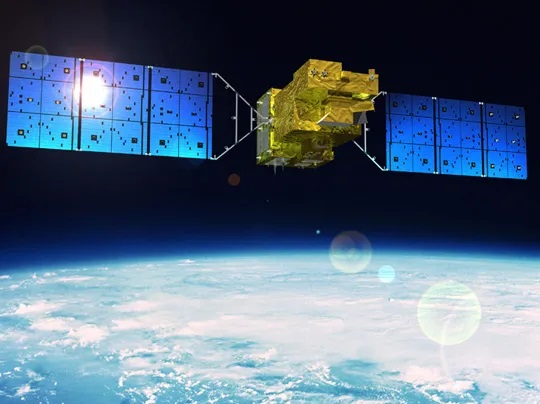
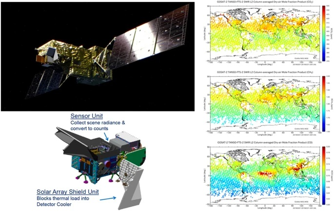
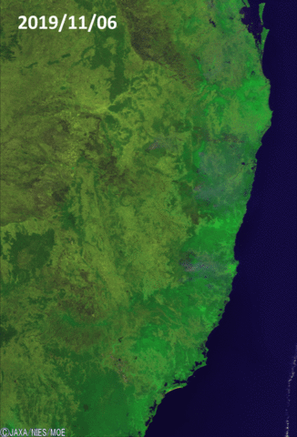
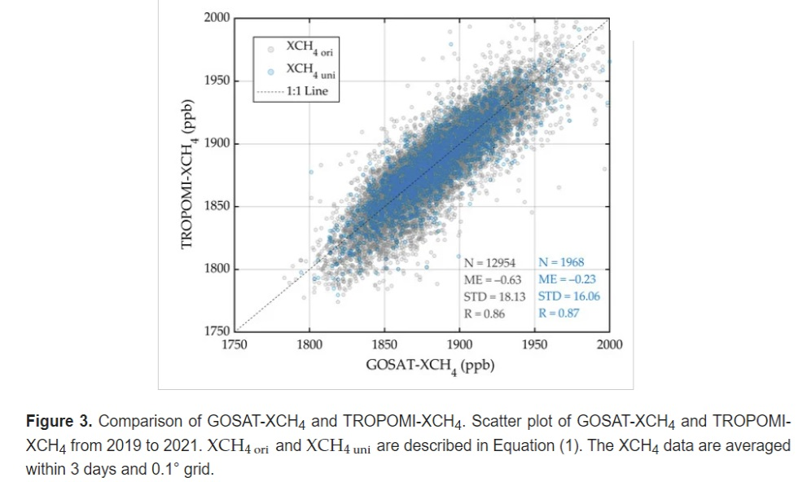
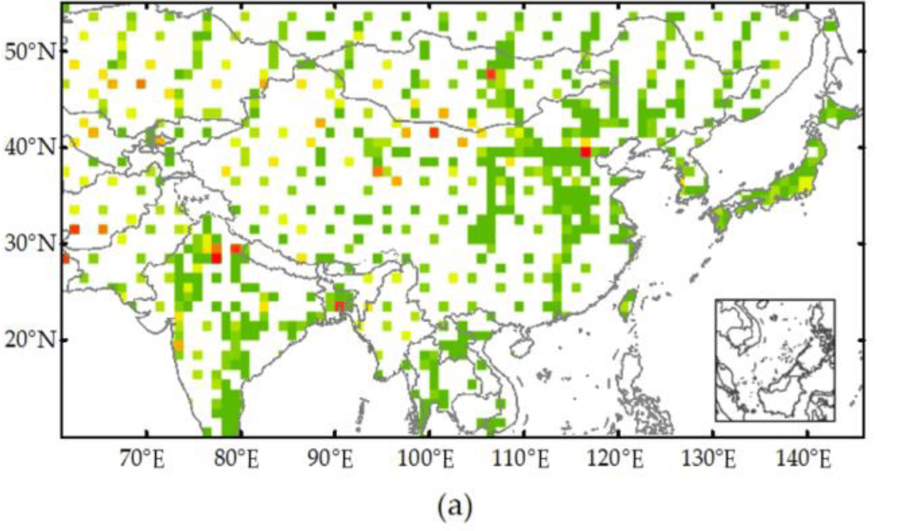
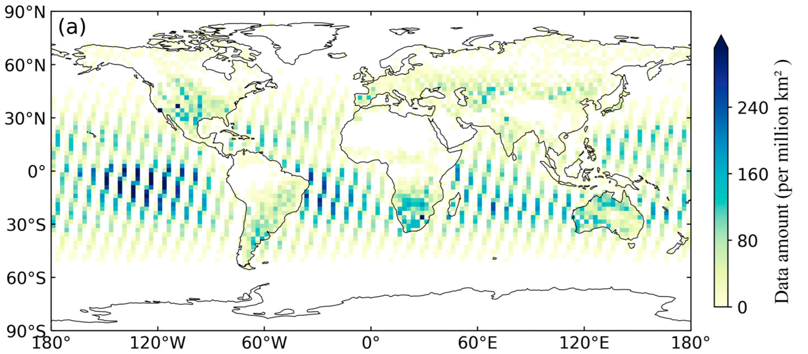
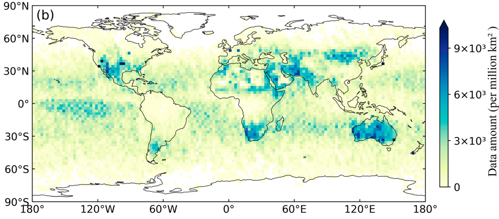
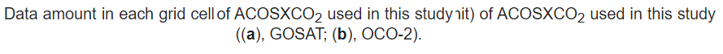

class: inverse, center, middle

#IBUKI-2
 
---
class: left , inverse 

# Summary 1: 
--

## What is the IBUKI-2 satellite ? 

* Also known as GOSAT 2 is a satellite that was launched in 2018.

* This satellite is designed to monitor greenhouse gases.

* Measure the levels of carbon dioxide, methane, ozone, and water vapor in the atmosphere.

* Measure the carbon monoxide and nitrogen dioxide levels.

```{r echo=FALSE, out.width='50%', fig.align='center'}


```


---
class: center , inverse

# Summary 2:  
--

## IBUKI-2 satellite Details

.pull-left[

* GOSAT-2 has an  FTS (Fourier Transform Spectrometer) and Imager instruments.

* The FTS measures greenhouse gas concentrations in the Earth's atmosphere.

* The Imager captures images of the Earth's surface for tasks like land cover mapping. 
]

.pull-right[
 
* Orbiting altitude 613KM

* Revisiting frequency 3 days

* Spectral resolution 0.2 cm-1

* Orbiting type Sun-synchronous

]

---
class: left , inverse 
# Summary 3: 
--

##The process of IBKUI-2 works 

GOSAT-2 uses advanced sensors like the Fourier Transform Spectrometer (FTS) and Cloud and Aerosol Imager (CAI) to monitor carbon dioxide levels. It corrects received data for atmospheric interference and instrument noise onboard before transmitting it to ground stations. Ground-based analysis and calibration provide valuable insights into climate change and environmental monitoring, influencing policy decisions and enhancing our understanding of Earth's climate system.

```{r echo=FALSE, out.width='50%', fig.align='center'}

```
---
class: left , inverse 

# Summary 4:
--

## The benefits of GOSAT satellites

The GOSAT satellites, have been invaluable tools over their years of operation. Ibuki, in particular, has played a pivotal role in:

* Supporting policymakers in formulating new climate legislation.

* Gathering diverse datasets to aid climate researchers and scientists in comprehending the environmental effects of human activities.

* Enhancing our understanding of the origins of greenhouse gas emissions and strategies for mitigation.

* Documenting rare occurrences like solar eclipses and volcanic eruptions, providing unique insights into Earth's phenomena.
 
---
class: center , inverse 

# Summary 4:
--

## The benefits of GOSAT satellites

<iframe width="640" height="360" src="https://www.youtube.com/embed/PPsdlItQkXs?si=cCkp0oDqE0FnJWaq" frameborder="0" allowfullscreen></iframe>

---
class: left , inverse 

# Applications 1

--

### Massive bushfires in Australia seen from Space
.pull-left[ Australia has faced severe bush fires since September 2019. The fires remain out of control and were expected to continue into January 2020. Besides personal and economic losses, they also pose significant environmental threats. The CAI on GOSAT observed eastern Australia. On September 1, 2019, no smoke was detected. By September 7, two yellow areas indicated massive fires, with blackened burned-out areas. By November 6, smoke appeared to dissipate toward the Pacific Ocean. However, by November 9, burned-out areas expanded, and fire spread accelerated.]

```{r echo=FALSE, out.width='45%', fig.align='right'}

```

---
class: left , inverse 

# Applications 2

--

### Spatial and Temporal Variations of Atmospheric CH4 in Monsoon Asia Detected by Satellite Observations of GOSAT and TROPOMI
.pull-left[Methane (CH4) concentration in the Asian monsoon region has steadily increased, yet understanding the relationship between CH4 emissions and their spatiotemporal distribution remains challenging due to diverse emission sources and varying climate and land cover types. This study aims to address this gap by generating a regional long-term XCH4 spatiotemporal continuous dataset (Mapping-XCH4) using GOSAT and TROPOMI data from 2009 to 2021. By examining the spatiotemporal variation trend of XCH4 at different spatial scales.]

```{r echo=FALSE, out.width='45%', fig.align='right'}



```

---
class: left , inverse 

# Applications 3

--

### Spatial and temporal distribution of carbon dioxide gas using GOSAT data over IRAN
This study investigated carbon dioxide (CO2) concentration in Iran during different seasons of 2013 using GOSAT data. The ordinary kriging method was employed to assess CO2 distribution, while factors like Land Surface Temperature (LST), Normalized Difference Vegetation Index (NDVI), and meteorological data from MODIS were considered. Results revealed higher CO2 levels in southern regions and lower levels in the north.

--
### IBUKI provides images of Iceland volcano eruption to the British Government
Global images were captured every three days by the IBUKI satellite equipped with the TANSO-CAI sensor. From April 15 onward, smoke over Iceland and other European countries, along with a significant eruption on the 17th, was imaged. The British Government requested observation data for model verification, leading to the provision of processed images taken by IBUKI in response. This data provision continued until the end of April.

---
class: left , inverse 

# Applications 4

--

### Comparison of Atmospheric Carbon Dioxide Concentrations Based on GOSAT, OCO-2 Observations and Ground-Based TCCON Data
.pull-left[This study compares atmospheric CO2 observations from (GOSAT and OCO-2) with data from the Total Carbon Column Observing Network (TCCON). Results show a strong correlation between TCCON and both satellite measurements, indicating reliable calibration. Consistency is higher in Asia, North America, and Oceania compared to Europe, South America, and Africa, with seasonal variations more consistent in spring than summer due to potential cloud and aerosol interference. These findings emphasize the importance of monitoring and calibrating for precise CO2 level assessment.]

```{r echo=FALSE, out.width='50%', fig.align='right'}



```

---
class: left , inverse 

# Reflictions on GOSAT-2

--

* Satellites dedicated to measuring and monitoring greenhouse gases continue to advance over time.

* GOSAT-2 utilizes advanced sensors like the Fourier Transform Spectrometer (FTS) and Cloud and Aerosol Imager (CAI) to monitor carbon dioxide levels.

* Onboard correction of data for atmospheric interference and instrument noise ensures data accuracy.

* Ground-based analysis and calibration provide valuable insights into climate change and environmental monitoring.

* Satellite observations influence policy decisions and advance our understanding of Earth's climate system.

* Overall, GOSAT-2 plays a crucial role in efforts aimed at mitigating climate change by providing accurate data and informing policy decisions.

---
class: left , inverse 

# Refrences 

<small>Spatial and temporal distribution of carbon dioxide gas using GOSAT data over IRAN: 
https://link.springer.com/article/10.1007/s10661-017-6285-8#Sec4


Comparison of Atmospheric Carbon Dioxide Concentrations Based on GOSAT, OCO-2 Observations and Ground-Based TCCON Data: https://www.mdpi.com/2072-4292/15/21/5172

Spatial and Temporal Variations of Atmospheric CH4 in Monsoon Asia Detected by Satellite Observations of GOSAT and TROPOMI: https://www.mdpi.com/2072-4292/15/13/3389#

Massive bushfires in Australia seen from Space : https://www.eorc.jaxa.jp/en/earthview/2020/tp200218.html

IBUKI provides images of Iceland volcano eruption to the British Government: 
https://global.jaxa.jp/projects/sat/gosat/topics.html 

https://greenly.earth/en-gb/blog/ecology-news/what-should-we-learn-from-gosat-satellite-ibuki

https://earth.esa.int/eogateway/catalog/gosat-2-tanso-fts-2-and-cai-2-full-archive-and-new-products

https://nssdc.gsfc.nasa.gov/nmc/spacecraft/display.action?id=2018-084B
</small>


--- 


---

class: inverse, center, middle

# Thank you 
